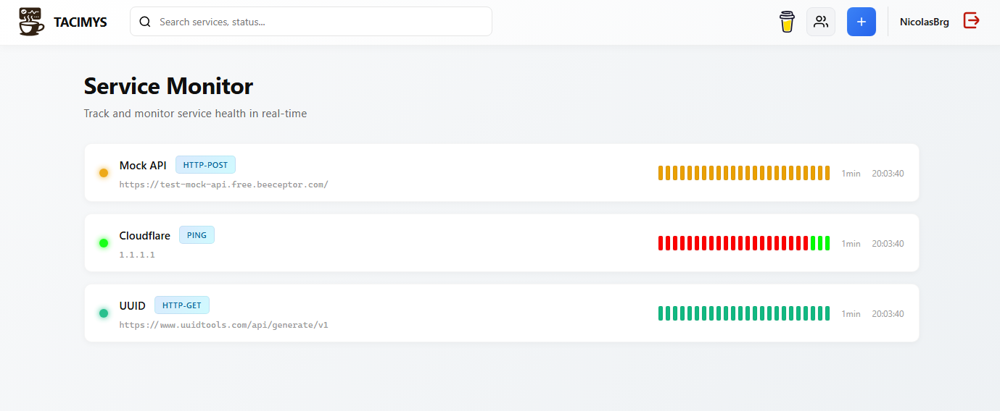

# Take A Coffee I'm Monitoring Your Services ☕

<div align="center">

**A modern, open-source service monitoring platform that keeps you informed while you enjoy your coffee**

[](LICENSE)
[](https://nodejs.org/)
[](#)
[](#contributing)

</div>



## About

**Take A Coffee I'm Monitoring Your Services** is a lightweight, easy-to-deploy service monitoring solution designed to help teams track the health and status of their infrastructure without breaking the bank.

Whether you're monitoring microservices, APIs, websites, or network endpoints, this project provides real-time insights with a beautiful, intuitive interface. Get status updates with customizable color-coded indicators, set your own monitoring rules using regex patterns, and manage access control across your team using a Role-Based Access Control (RBAC) system.

## 🌟 Key Features

### Core Monitoring
- **Multiple Check Types**: HTTP (GET, POST, PUT), PING, and extensible protocol support
- **Real-Time Status Updates**: Configurable polling frequency for each service
- **Custom Status Colors**: Define your own color indicators using powerful regex pattern matching
- **History Tracking**: Retain and analyze monitoring history with configurable retention policies

### Security & Access Control
- **Authentication System**: Secure login with JWT-based session management
- **Role-Based Access Control (RBAC)**: Organize users into groups with granular permissions
- **Group Permissions**: Share services with team members using permission-based groups
- **Service Ownership**: Clear ownership model with granular access levels (VIEW, EDIT)

### Service Authentication
Monitor services that require authentication with support for multiple auth methods:
- **Bearer Token Authentication**: For OAuth and API token-based services
- **Basic Authentication**: Username and password credentials
- **Custom Header Authentication**: Any custom authentication header for unique requirements

### Developer Friendly
- **100% Free & Open Source**: No licensing costs, fully community-driven
- **Easy to Deploy**: Single-command deployment on any Node.js environment
- **Clean JSON Configuration**: Human-readable service and group management
- **RESTful API**: Full API for programmatic access and integration

## 🚀 Quick Start

### Prerequisites
- Node.js v14 or higher
- npm or yarn

### Installation

1. **Clone the repository**
   ```bash
   git clone https://github.com/NicolasBrg/TACIMYS.git
   cd take-a-coffee-monitoring
   ```

2. **Install dependencies**
   ```bash
   npm install
   ```

3. **Start the server**
   ```bash
   npm start
   ```

3. **Access the application**
   - Open http://localhost:3000 in your browser
   - Create your account and start monitoring!

## 📋 How It Works

### 1. **User Registration & Authentication**
Start by creating an account with a secure password. Your credentials are protected with industry-standard bcrypt hashing.

### 2. **Create Groups**
Organize team members into groups for easier permission management. Each group can have multiple members and distinct permissions.

### 3. **Monitor Services**
Add services to monitor:
- Define the service type (HTTP, PING, etc.)
- Set the target URL or IP
- Configure authentication if needed
- Define custom rules with regex patterns and colors

### 4. **Set Monitoring Rules**
Create custom rules that match response patterns:
```
Pattern: "error"        → Color: Red (#FF0000)
Pattern: "success"      → Color: Green (#00FF00)
Pattern: "warning|slow" → Color: Orange (#FFA500)
```

### 5. **Share with Team**
Grant group permissions to your services:
- **VIEW**: Team members can see the service status
- **EDIT**: Team members can modify service configuration **INCLUDING** secrets.

## 🎨 Customization

### Service Monitoring Types
- **http-get**: GET request
- **http-post**: POST request with optional body
- **http-put**: PUT request with optional body
- **ping**: ICMP ping check

### Status Colors
Fully customizable with CSS-compatible color values:
- Hex: `#FF0000`
- RGB: `rgb(255, 0, 0)`
- Named: `red`, `green`, `blue`, etc.

### History Configuration
- **history_count**: Number of entries to store (default: 24)
- **max_retention_hours**: How long to keep history (default: 24 hours)
- **frequency**: Check interval in minutes (default: 1 minute)

## 📁 Project Structure

```
take-a-coffee-monitoring/
├── server.js                 # Express.js backend server
├── index.html               # Main HTML interface
├── style.css                # Application styling
├── conf.json                # Data storage (JSON database)
├── front/
│   ├── auth/               # Authentication modules
│   ├── builders/           # UI component builders
│   ├── services/           # API and utility services
│   └── utils/              # Helper functions
├── assets/
│   └── icons/              # SVG icons and logos
└── history/                # Service check history storage
```

## 🔒 Security

- **Password Protection**: Bcrypt-hashed passwords, never stored in plain text
- **JWT Authentication**: Stateless session management
- **RBAC Authorization**: Fine-grained access control
- **Group-Based Permissions**: Transparent sharing model
- **No External Dependencies for Auth**: Built-in authentication, no third-party services required

## 🚀 Deployment

### Docker
```bash
docker build -t take-a-coffee .
docker run -p 3000:3000 take-a-coffee
```

### Direct Node.js
```bash
npm install
npm start
```

### Docker Compose
```yaml
version: '3'
services:
  app:
    build: .
    ports:
      - "3000:3000"
    volumes:
      - ./conf.json:/app/conf.json
      - ./history:/app/history
```

### Environment Variables
```
JWT_SECRET=your-super-secret-key-change-in-production
PORT=3000
```

## 🤝 Contributing

We love contributions! Whether you're fixing bugs, adding features, or improving documentation, your help is welcome.

See [CONTRIBUTING.md](CONTRIBUTING.md) for detailed guidelines on how to contribute.

### Quick Contribution Steps
1. Fork the repository
2. Create a feature branch (`git checkout -b feature/amazing-feature`)
3. Commit your changes (`git commit -m 'Add amazing feature'`)
4. Push to the branch (`git push origin feature/amazing-feature`)
5. Open a Pull Request

## 📝 License

This project is licensed under the **NCSA-CA License** (Non-Commercial ShareAlike with Commercial Approval). See [LICENSE](LICENSE) for details.

For commercial use or inquiries, please contact the project author.

## 💝 Support

If you find this project helpful, consider supporting the development:

<a href="https://buymeacoffee.com/nicolasbrg" target="_blank">
  
</a>

Your support helps keep this project maintained and evolving!

## 🐛 Bug Reports & Feature Requests

- **Bug Report**: Open an issue with a detailed description and steps to reproduce
- **Feature Request**: Share your ideas in an issue with use cases and expected behavior
- **Questions**: Feel free to ask questions in discussions or issues

## 📞 Contact

- GitHub Issues: [Report bugs or request features](https://github.com/NicolasBrg/TACIMYS/issues)
- Discussions: [Ask questions and share ideas](https://github.com/NicolasBrg/TACIMYS/discussions)

## ⭐ Show Your Support

If you find this project useful, please consider giving it a star on GitHub! It helps more people discover the project.

---

<div align="center">

**Take A Coffee I'm Monitoring Your Services** - Because monitoring shouldn't be complicated.

Made with ☕ by the community, for the community.

</div>
